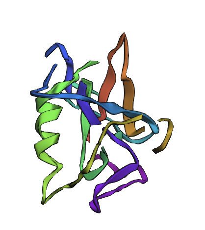
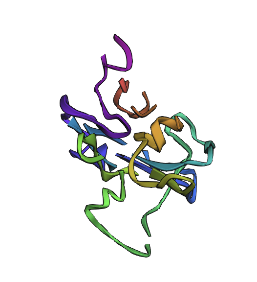
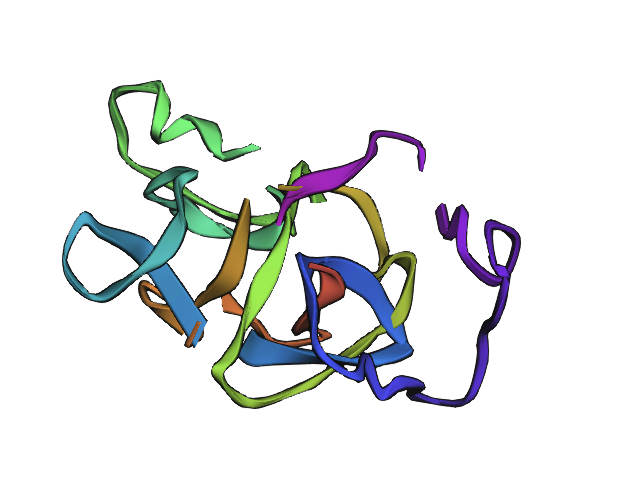

  
  
  

## P(all-atom)

`pallatom/` is a from-scratch reimplementation of
[Pallatom](https://www.biorxiv.org/content/10.1101/2024.08.16.608235v4.full.pdf), an all-atom protein
diffusion model that generates novel protein structures and sequences
jointly, rather than predicting structure from a known sequence. Its
denoising trunk borrows heavily from AlphaFold3's architecture — the same
atom-attention encoder/decoder, pair-representation updates, and diffusion
sampling machinery — but repurposed for unconditional generation instead of
structure prediction. Aside from import logic, this implementation was built
to Google DeepMind's quality standards as per my experience at Latent Labs:
the repo is aggressively type-checked with the most stringent basedpyright
settings, takes strict advantage of ruff and xenon on top of Google's style
guide pylint, and lints docstrings with pydoclint to enforce faithful Google-style
usage. Custom lint scripts additionally force the use of jaxtyping and einops
wherever tensor shapes or operations are involved (see
[docs/best_practices.md](docs/best_practices.md) for the full rundown). The
current implementation targets **pallatom-bb** (backbone-only) to keep GPU
compute manageable, and was trained on a Vast.ai instance with 4x RTX 5060 Ti
for under $20. The build is a portable devcontainer optimized for multi-GPU,
single-node CUDA usage, with an arm64-compatible devcontainer for local
MacBook development (see
[docs/first_time_instructions.md](docs/first_time_instructions.md)). The
training set is a filtered subset of
[CATH](https://www.cathdb.info/), to be upgraded to a larger dataset later.

---

## Docs

- [docs/first_time_instructions.md](docs/first_time_instructions.md) — enabling
  pre-commit hooks and setting up the devcontainer on a new CUDA machine.
- [docs/best_practices.md](docs/best_practices.md) — code quality gates and
  practical rules for writing new code in this repo.
- [docs/self_hosted_runner.md](docs/self_hosted_runner.md) — registering a
  machine as a GitHub Actions self-hosted GPU runner.
