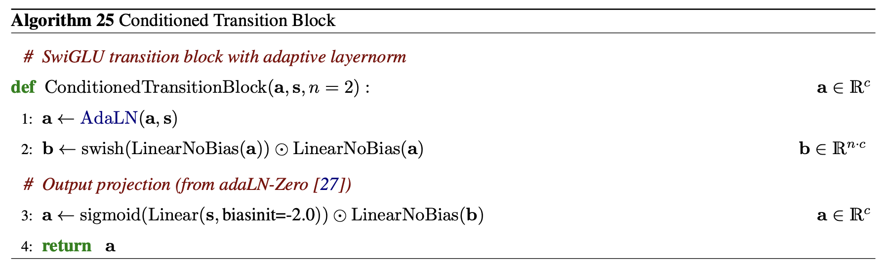
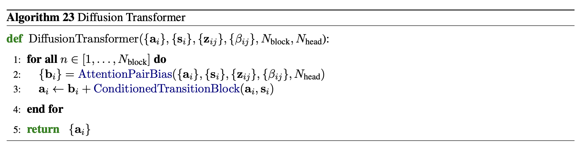
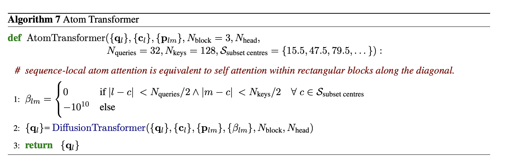
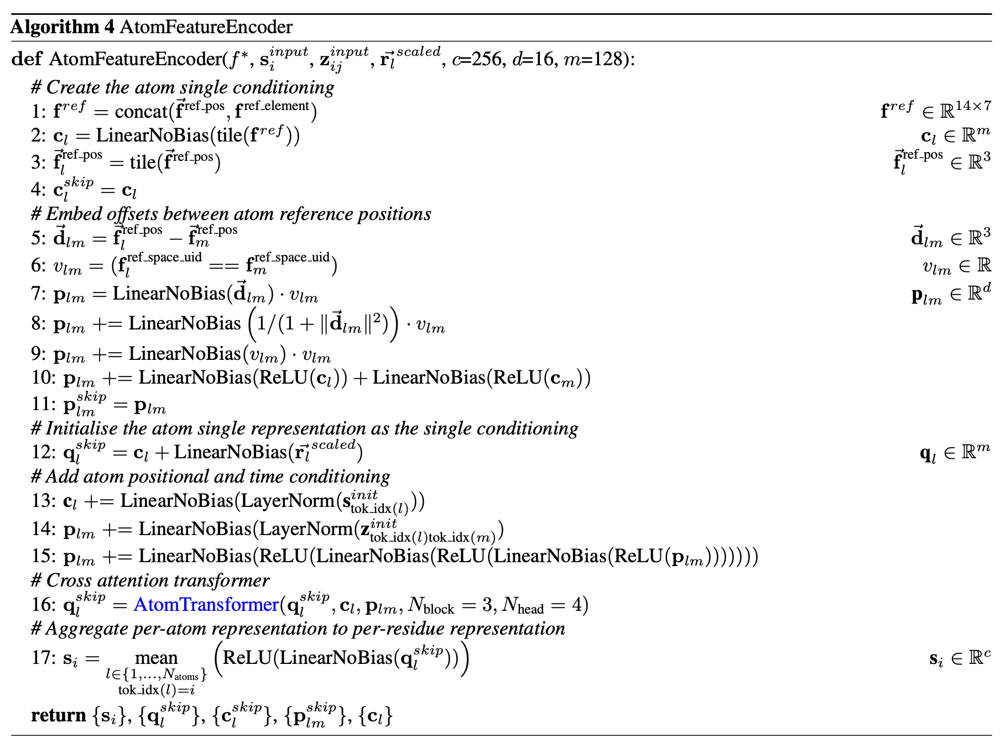
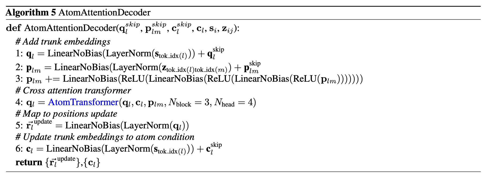

# `atom_transformers.py` — atom-level transformers

[← back to architecture overview](../README.md)

Atom-level local and global attention modules: `scatter_mean`,
`build_sparse_pairs`, `compute_beta`, `ConditionedTransitionBlock`,
`DiffusionTransformer`, `AtomTransformer`, `AtomFeatureEncoder`, and
`AtomAttentionDecoder`. These implement the fine-grained, per-atom half of
`MainTrunk` — encoding raw reference atoms into residue embeddings (step 7)
and decoding trunk embeddings back into per-atom position updates (step 12
of each decoder unit). See [main_trunk.md](main_trunk.md).

## Sparse local attention infrastructure

All atom-pair tensors in this module are sparse: instead of a dense `(N,
N)` pair matrix, every atom attends only to a local window of `K` neighbours
(`K` varies by sequence length; typically ≤ 448 for a 32-residue window with
~14 atoms/residue).

- **`scatter_mean`** — per-segment mean pooling via `scatter_add_`, used to
  average atom-level features into residue-level features (`tok_idx` maps
  each atom to its residue).
- **`build_sparse_pairs`** — for each atom `l`, builds the list of atom
  indices `m` with `|tok_idx[l] - tok_idx[m]| < window_size // 2`, returning
  `(neighbor_idx, valid_mask)` tensors of shape `(N, K)`.
- **`compute_beta`** — Algorithm 7, line 1. Computes the sliding-window
  attention bias `β`: 0.0 for atom pairs admitted by a shared query/key
  window centre (and by `valid_mask`), `-1e10` otherwise. Query-window
  centres are spaced every `n_queries` atoms; each atom's key window (width
  `n_keys`) is centred on its assigned query-window centre, not on the atom
  itself. Callers must keep `n_keys >= n_queries`, or atoms near a block edge
  can end up with a fully-masked attention row.

## `ConditionedTransitionBlock`



A gated transition block conditioned on a sequence embedding `s` via
adaLN-Zero:

1. `a ← AdaLN(a, s)` — see [node_update.md](node_update.md#adaln--algorithm-26).
2. `b ← swish(Linear(a)) ⊙ Linear(a)` (SwiGLU gate).
3. `a ← sigmoid(Linear(s, biasinit=-2.0)) ⊙ Linear(b)` — the negative bias
   init means the block starts near-identity (output gate near zero) at
   initialization, which is the "adaLN-Zero" trick.

## `DiffusionTransformer`



Runs `N_block` independently-weighted rounds of:

```
b = AttentionPairBias_n(a, s, z, β)
a = b + ConditionedTransitionBlock_n(a, s)
```

matching the AF3 DiffusionTransformer loop. See
[node_update.md](node_update.md#attentionpairbias) for `AttentionPairBias`.
This is the shared inner loop used by both `AtomFeatureEncoder` and
`AtomAttentionDecoder` (via `AtomTransformer`, below).

## `AtomTransformer` — Algorithm 7



Wraps `DiffusionTransformer` with the sliding-window sparse attention
described above:

1. Compute the `β` sliding-window bias once via `compute_beta`.
2. Run `DiffusionTransformer`, passing `β` as an additive attention bias to
   every block and `neighbor_idx` so attention stays sparse.

Used with `n_queries=32, n_keys=128` inside `AtomFeatureEncoder`, and with
`n_queries=window_size, n_keys=window_size*4` inside `AtomAttentionDecoder`.

## `AtomFeatureEncoder` — Algorithm 4



Encodes per-atom reference features (`ref_pos`, `ref_element`,
`ref_space_uid`) into per-residue embeddings, seeded by the trunk's
`s_init`/`z_ij`. Runs (see inline step comments in the source for the exact
16-step sequence):

1. Build the sparse neighbour index (`build_sparse_pairs`) and
   chain-validity mask from `ref_space_uid`.
2. Concatenate each atom's sibling atoms' `ref_pos`/`ref_element` into
   `f_ref`, project to the atom-single dimension `c_l`; clone into
   `c_skip`.
3. Build the sparse atom-pair embedding `p_lm` from pairwise reference
   displacement vectors, inverse-square distance, a same-chain flag, and
   projected atom-single features — then add the trunk pair embedding
   `z_input` gathered at each atom pair's residue indices, and refine with a
   3-layer residual MLP.
4. `q_skip = c_l + proj(r_scaled)`; `c_l += proj(LayerNorm(s_input[tok_idx]))`
   — the atom query/context embeddings pick up the noisy-position signal and
   the trunk single embedding.
5. Run `AtomTransformer` over `(q_skip, c_l, p_lm)`.
6. Pool atom embeddings back to residues (`s_i = scatter_mean(...)`).

Returns `(s_i, q_skip, c_skip, p_skip, c_l)` — the five tensors threaded
through the rest of `MainTrunk` as skip connections (see the tensor
reference table in
[`pallatom/CLAUDE.md`](../../CLAUDE.md#maintrunk-tensor-reference)).

## `AtomAttentionDecoder` — Algorithm 5



The inverse direction: decodes the current trunk embeddings (`s`, `z`) back
to a per-atom position update. Given the encoder's skip tensors (`q_skip`,
`p_skip`, `c_skip`) and the trunk's current `c`, `s`, `z`:

1. `q = proj(LayerNorm(s[tok_idx])) + q_skip`
2. `p = proj(LayerNorm(z[tok_l, tok_m])) + p_skip`, refined by a residual MLP
   and re-masked to zero out padding slots.
3. Run `AtomTransformer` over `(q, c, p)`.
4. `r_update = proj(LayerNorm(q))` — the per-atom 3D position delta.
5. `c_out = proj(LayerNorm(s[tok_idx])) + c_skip` — the updated atom context,
   carried into the next decoder unit.

Invoked once per decoder unit in `MainTrunk.forward`, wrapped in
`torch.utils.checkpoint.checkpoint`.
