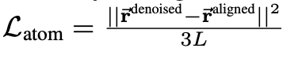
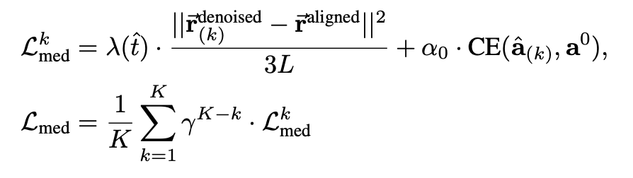
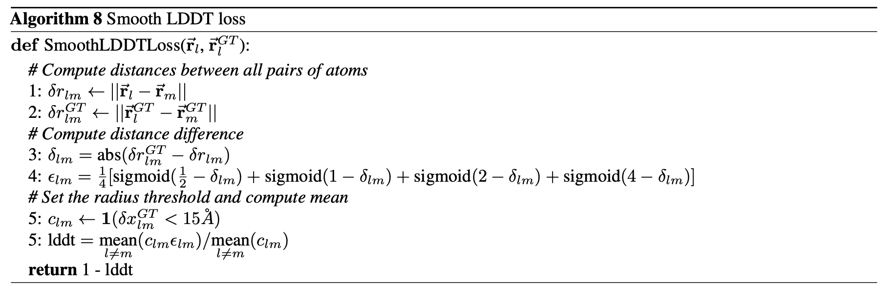
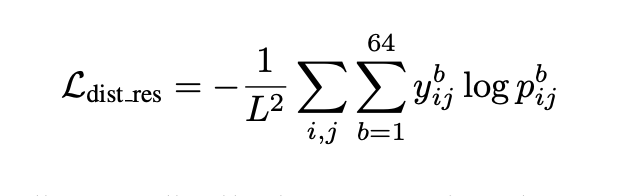
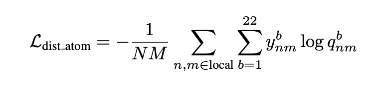
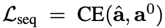
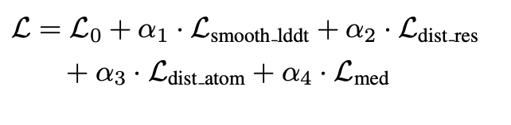
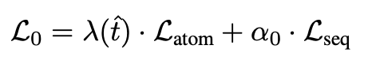

# `losses.py` — training losses

[← back to architecture overview](../README.md)

Loss functions for diffusion-model training: Kabsch-aligned atom-coordinate
MSE, smooth lDDT, residue and atom distogram cross-entropy, intermediate
(`L_med`) decoder-block supervision, and sequence cross-entropy. Every
function here returns an unreduced-over-batch (or fully scalar) loss; the
weighted sum that combines them into `total_loss` is assembled in
`train/train_loop.py`, not in this module — see
[Combining the losses](#combining-the-losses-total_loss) below.

## `atom_loss` — Kabsch-aligned MSE



Rigidly aligns the ground-truth structure onto the denoised prediction (GT is
rotated/translated to match; gradients flow only through the prediction, not
through the SVD in `kabsch_align`), then computes EDM-weighted mean squared
deviation:

```
L_atom = lambda_sigma · ||r_denoised - r_aligned||² / (3L)
```

where `L` is the number of unmasked residues and `lambda_sigma = (t̂² +
sigma_data²) / (t̂ · sigma_data)²` is the per-sample EDM noise weight.

## `med_loss` — `L_med`

Intermediate supervision loss, averaged over the `K` decoder blocks with
geometric weight decay favouring later blocks:

```
L_med = (1/K) · Σ_{k=1}^{K} gamma^(K-k) · L^k_med
```

with `gamma < 1` so earlier blocks are progressively discounted and the
final block always receives weight 1. Each block's loss combines a
structural term (`atom_loss`, using the same EDM `lambda_sigma_weight` as
the outer loss) and a sequence term (`seq_ce_loss`), weighted by `lam` and
`alpha_0` respectively. Raises `NoDenoiserBlockError` if the block list is
empty, `BlockCountMismatchError` if the structure and sequence block lists
have different lengths ([errors.md](errors.md)).



## `smooth_lddt_loss`



A differentiable relaxation of the lDDT structure-similarity metric
(Pallatom Algorithm 8):

1. `δr_lm` / `δr_lm_GT` — predicted / ground-truth pairwise distances
   (`pairwise_dist`).
2. `δ_lm = |δr_lm_GT - δr_lm|`.
3. `ε_lm = ¼[sigmoid(½-δ) + sigmoid(1-δ) + sigmoid(2-δ) + sigmoid(4-δ)]` — a
   smooth per-pair agreement score in `(0, 1)`, replacing lDDT's hard
   distance-threshold bins with sigmoids so the metric is differentiable.
4. `c_lm = 1(δr_lm_GT < cutoff)` restricted to `l ≠ m` — the local
   neighbourhood mask (default cutoff 15 Å).
5. `lddt = mean_{l≠m}(c·ε) / mean_{l≠m}(c)`; loss `= 1 - lddt`.

## `distogram_loss_residue` / `distogram_loss_atom`




Both supervise predicted distance-bin logits against one-hot (or integer
index) ground-truth bins via masked cross-entropy:

```
L_dist_res  = -1/N_res²   · Σ_{i,j}   Σ_b y^b_ij · log p^b_ij
L_dist_atom = -1/(N_atom·K) · Σ_{n,k} Σ_b y^b_nk · log q^b_nk
```

`distogram_loss_residue` operates on the dense `(N_res, N_res)` pair
distogram head output; `distogram_loss_atom` operates on the sparse
`(N_atom, K)` local-window atom distogram head output (see
[atom_transformers.md](atom_transformers.md) for how `p_update`, the source
of the atom distogram logits, is produced).

## `seq_ce_loss`



Standard cross-entropy over the 20-class amino-acid sequence logits, with
positions ignored when `aa_indices < 0` (padding) or `aa_indices >= n_amino`
(PDB-X / conditioning-dropped tokens) — only real, visible amino acids
contribute to the loss.

## Shared helper: `pairwise_dist`

Computes an `(..., N_atom, N_atom)` Euclidean distance matrix via `einsum`,
with a `1e-8` epsilon under the square root to avoid a zero-gradient
singularity at coincident points. Used by `smooth_lddt_loss`.

## Combining the losses: `total_loss`




None of the functions above run in isolation — `train/train_loop.py` calls
each of them once per training step and combines the results into a single
scalar:

```
total_loss = lam     · Kabsch_aligned_MSE_loss   (atom_loss)
           + alpha_0 · CE_loss                    (seq_ce_loss)
           + alpha_1 · lddt_loss                  (smooth_lddt_loss)
           + alpha_2 · residue_distogram_loss      (distogram_loss_residue)
           + alpha_3 · atom_distogram_loss         (distogram_loss_atom)
           + alpha_4 · intermediate_loss           (med_loss)
```

with the six `lam`/`alpha_*` weights supplied by `LossParams`. This module
has no single function corresponding to that combination, which is why the
two pseudocode diagrams above are attached to this section rather than to
any one function.
