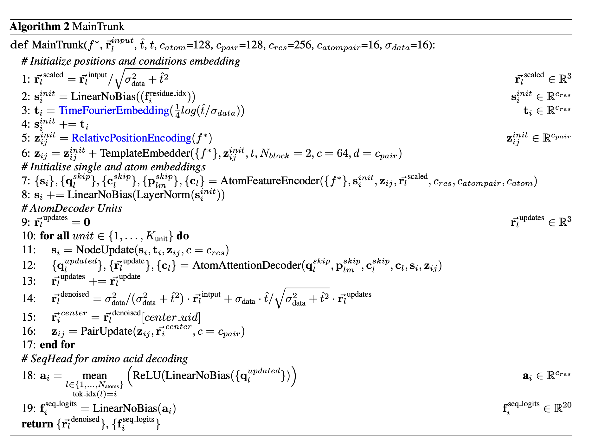
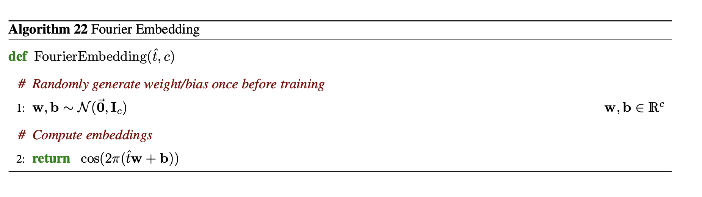
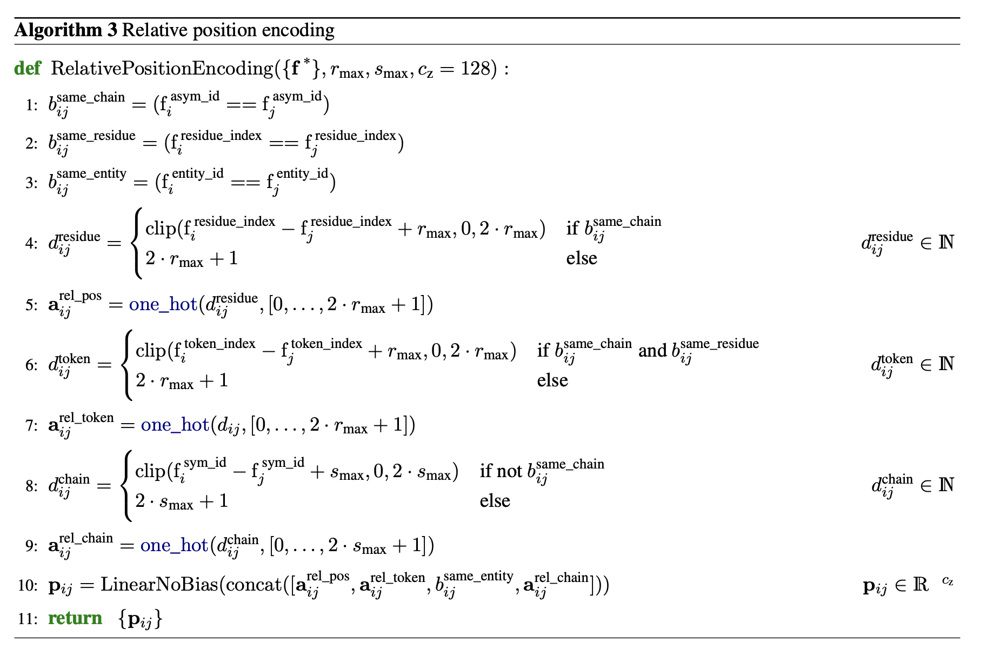

# `main_trunk.py` — MainTrunk

[← back to architecture overview](../README.md)

`MainTrunk` is the top-level denoiser: it implements Algorithm 2 from the
AlphaFold 3 paper, adapted to Pallatom's all-atom diffusion setting. It wires
together the [`TemplateEmbedder`](template_embedder.md), the
[`AtomFeatureEncoder`/`AtomAttentionDecoder`](atom_transformers.md), the
[`NodeUpdate`](node_update.md), and the [`PairUpdate`](pair_update.md) into a
single forward pass that maps a noised structure to a denoised one and a
predicted amino-acid sequence.

For the full tensor-shape reference (every named dimension and every tensor
that flows through `MainTrunk`), see the
[MainTrunk tensor reference](../../CLAUDE.md#maintrunk-tensor-reference) table in
`pallatom/CLAUDE.md` — this doc stays focused on structure and control flow.

## Two-phase forward pass

`MainTrunk.forward` is split into `embed_inputs` (steps 1–8, embedding
construction) and the decoder loop (steps 9–19, iterative refinement). The
split exists so `EmbeddedInputs` can be inspected independently for
interpretability, and so the decoder loop can checkpoint each block without
recomputing the embedding step.

### `embed_inputs` — steps 1–8

1. **`r_scaled`** — the noisy input positions `r_input` are rescaled by
   `1/sqrt(sigma_data² + t̂²)`, the EDM `c_in` scaling factor.
2. **`s_init`** — a one-hot residue-index feature is projected to `c_res`.
3. **`t_i`** — the noise level `t̂` is mapped through `TimeFourierEmbedding`
   (see below) and broadcast to every residue.
4. `s_init += t_i`.
5. **`z_ij`** — `RelativePositionEncoding` (see below) builds the initial pair
   embedding from relative residue/token/chain identity.
6. `z_ij += TemplateEmbedder(...)` — see [template_embedder.md](template_embedder.md).
7. **`AtomFeatureEncoder`** consumes reference atom positions/elements plus
   `s_init`/`z_ij` and produces `s_i`, `q_skip`, `c_skip`, `p_skip`, `c_l` —
   see [atom_transformers.md](atom_transformers.md#atomfeatureencoder--algorithm-4).
8. `s_i += LinearNoBias(LayerNorm(s_init))` — a skip connection back to the
   pre-encoder residue embedding.

### Decoder loop — steps 9–17 (`K_unit` iterations)

For each of `K_unit` decoder units:

- **Step 11**: `s_i = NodeUpdate(s_i, t_i, z_ij)` — refines the residue single
  embedding ([node_update.md](node_update.md#nodeupdate--algorithm-6)).
- **Step 12**: `AtomAttentionDecoder` turns the current trunk embeddings into
  a per-atom position update `r_update`
  ([atom_transformers.md](atom_transformers.md#atomattentiondecoder--algorithm-5)),
  wrapped in `torch.utils.checkpoint.checkpoint` for memory efficiency.
- **Step 13–14**: the position update is accumulated (`r_updates +=
  r_update`) and combined with the EDM `c_skip`/`c_out` weighting to form the
  current `r_denoised`. Both `r_denoised` and the per-block intermediate
  amino-acid logits are appended to the intermediate stacks returned in
  `PredictedOutputs`, which feed the auxiliary intermediate loss
  ([losses.md](losses.md#med_loss--l_med)).
- **Step 15**: `r_center`, the denoised position of each residue's designated
  center atom, is gathered from `r_denoised` via `center_uid`.
- **Step 16**: `z_ij = PairUpdate(z_ij, r_center)` refreshes the pair
  embedding from the new coordinates
  ([pair_update.md](pair_update.md#pairupdate--algorithm-7)), also
  checkpointed.

### Heads

After the loop, `z_ij` and the sparse atom-pair embedding `p_update` feed two
distogram heads (`residue_distogram_head`, `atom_distogram_head`), and
`q_update` (pooled per-residue via `scatter_mean`) feeds the final sequence
head to produce `f_seq_logits`.

## `TimeFourierEmbedding`

Maps the scalar noise level to a `c_res`-dimensional feature vector via fixed
(non-learned) random frequencies and phases:
`cos(2π · (x · freqs + phases))`. Implements Algorithm 22.

## `RelativePositionEncoding`

Implements Algorithm 3: builds `p_ij` from four one-hot pairwise features —
clipped relative residue distance, clipped relative token distance, a
same-entity flag, and clipped relative chain distance — then projects the
concatenation to `c_pair`. Chain/entity/symmetry IDs are currently spoofed to
zero (single-chain setting); only `residue_index` and the derived
`token_index` arange carry real signal today.
