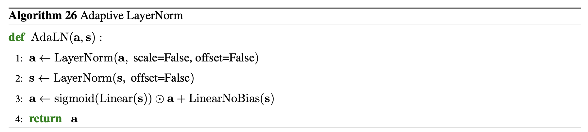
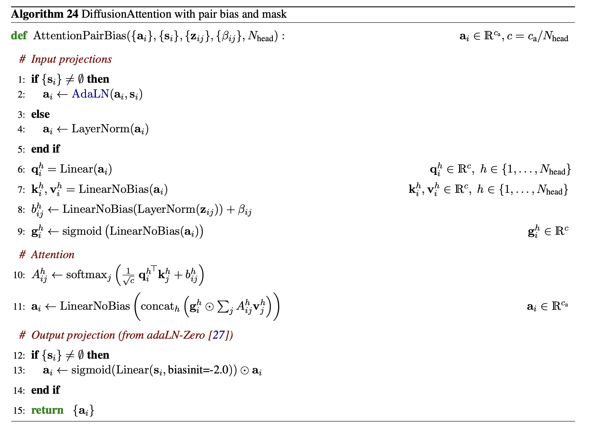
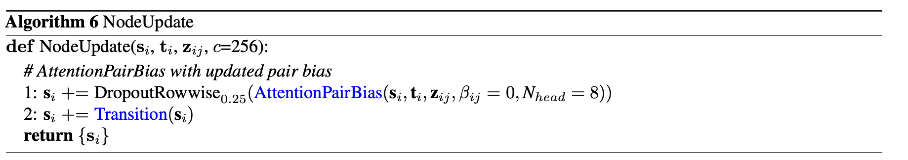

# `node_update.py` — NodeUpdate

[← back to architecture overview](../README.md)

Node-update modules for single-representation (`s_i`) refinement:
`AdaLN`, `AttentionPairBias`, and `NodeUpdate` itself (Algorithm 6). Invoked
once per decoder unit as step 11 of `MainTrunk.forward` — see
[main_trunk.md](main_trunk.md).

## `AdaLN` — Algorithm 26



Adaptive LayerNorm: normalises `a` (with no learned affine) and `s`
(without bias), then scales and shifts the normalised `a` by projections of
the normalised `s`:

```
a = sigmoid(to_scale(norm_s(s))) * norm_a(a) + to_shift(norm_s(s))
```

This lets a conditioning signal (time embedding, sequence embedding) directly
modulate another tensor's normalisation, rather than just being concatenated
or added. Reused as the conditioning mechanism inside
`ConditionedTransitionBlock` ([atom_transformers.md](atom_transformers.md#conditionedtransitionblock)).

## `AttentionPairBias`



Self-attention on node embeddings `a`, additively biased per-head by
projections of a pair embedding `z`, and conditioned on an optional signal
`s` via `AdaLN` (falling back to plain `LayerNorm` when `s is None`). Two
attention paths are implemented:

- **Dense**: full `N`-by-`N` self-attention when `neighbor_idx` is `None`.
- **Sparse**: attention restricted to `K` neighbours per query when
  `neighbor_idx` is supplied — gathers `k`/`v` at the neighbour indices so
  the attention logit shape stays `(B, n_heads, N, K)` instead of `(B,
  n_heads, N, N)`.

Output is additionally gated: `sigmoid(a_to_g(a)) * attention_output`, and
when `s` is provided, gated again by `sigmoid(s_to_a(s))` — the same
adaLN-Zero-style output gate used in `ConditionedTransitionBlock`. This
module is reused directly as the attention step inside
[`DiffusionTransformer`](atom_transformers.md#diffusiontransformer) (atom
level) and inside `PairformerBlock`
([pairformer_stack.md](pairformer_stack.md)) (residue level, biasing `s` on
`z`).

## `NodeUpdate` — Algorithm 6



1. `s_i += DropoutRowwise_0.25(AttentionPairBias(s, t, z, β=0, N_head=8))` —
   `s` attends to itself, conditioned on the time embedding `t` and biased by
   the pair embedding `z`.
2. `s_i += Transition(s_i)` — see
   [pair_update.md](pair_update.md#transition--step-5).
