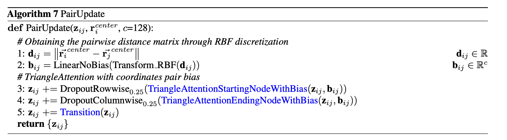
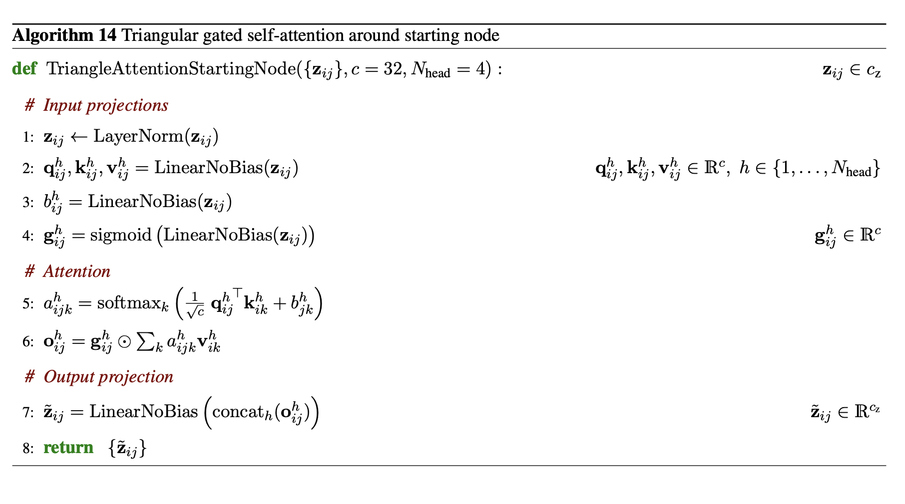
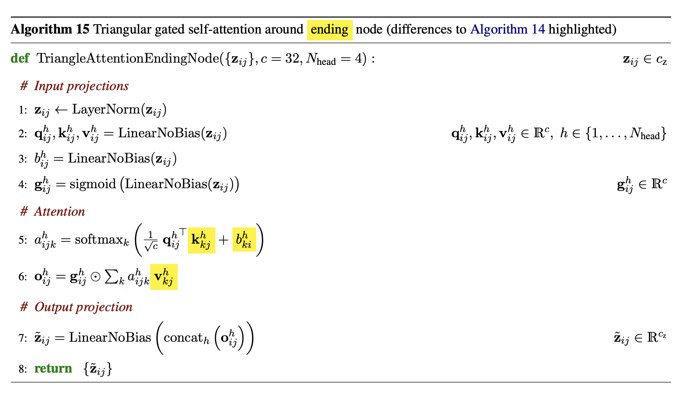
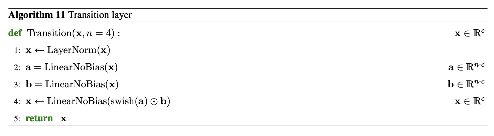

# `pair_update.py` — PairUpdate

[← back to architecture overview](../README.md)

`PairUpdate` implements Algorithm 7 from the AlphaFold 3 paper: it refreshes
the trunk pair embedding `z_ij` using the current denoised residue-center
coordinates. It replaces the simplified `PairUpdate` stub originally in
`main_trunk.py`, and is invoked once per decoder unit (step 16 of
`MainTrunk.forward`; see [main_trunk.md](main_trunk.md)).

## `PairUpdate` — Algorithm 7

1. **`d_ij = ||r_i^center - r_j^center||`** — pairwise Euclidean distance
   between residue center-atom coordinates.
2. **`b_ij = LinearNoBias(Transform_RBF(d_ij))`** — the scalar distance is
   discretized through `TransformRBF` (see below) into an RBF feature vector,
   then projected to `c_pair`.
3. `z_ij += DropoutRowwise_0.25(TriangleAttentionStartingNodeWithBias(z_ij, b_ij))`
4. `z_ij += DropoutColumnwise_0.25(TriangleAttentionEndingNodeWithBias(z_ij, b_ij))`
5. `z_ij += Transition(z_ij)`

## `TransformRBF`

Converts a scalar distance matrix into a radial basis function feature
vector: `n_rbf` (default 39) Gaussian centres evenly spaced between `d_min`
(3.25 Å) and `d_max` (50.75 Å), each with width `sigma` (default 5.0). This
is the standard RBF distance-discretization used to turn continuous
coordinates into a bias `PairUpdate` can add into pair-embedding space.

## `TriangleAttentionStartingNodeWithBias` — step 3

Row-wise gated self-attention on `z_ij`: for each row `i`, attend over all
`j` using queries/keys/values derived from `z`, with an additive per-head
bias projected from `b_ij` (here, the RBF-encoded coordinate distance) and a
sigmoid gate on `z`. Batch and heads are folded together for
`scaled_dot_product_attention` so the row loop over `N_res` rows runs as a
single batched call.

## `TriangleAttentionEndingNodeWithBias` — step 4

The column-wise counterpart: for each column `j`, attend over all `i`. Same
gated, biased attention mechanism as the starting-node variant, transposed.

Both `c_pair` in `PairUpdate` and in `PairformerBlock`
([pairformer_stack.md](pairformer_stack.md)) must be divisible by `n_heads`,
or `InvalidPairHeadDimensionError` is raised ([errors.md](errors.md)).

## `Transition` — step 5

Two-layer SwiGLU feed-forward block: `silu(W1·x) ⊙ W2·x`, projected back to
the input dimension `c`. Operates on any tensor whose last dimension is `c`
— used both on pair embeddings here and on `(c_pair * expansion)`-wide
intermediates elsewhere (`PairformerBlock.transition1`/`transition2`,
`NodeUpdate.transition`).

## `DropoutRowwise` / `DropoutColumnwise`

Structured dropout that zeroes entire rows (dim 1) or entire columns (dim 2)
of a pair tensor with probability `p` (default 0.25), rather than
independent per-element dropout — matching the AF3 training recipe for
triangle updates. A no-op outside of training or when `p == 0`.
