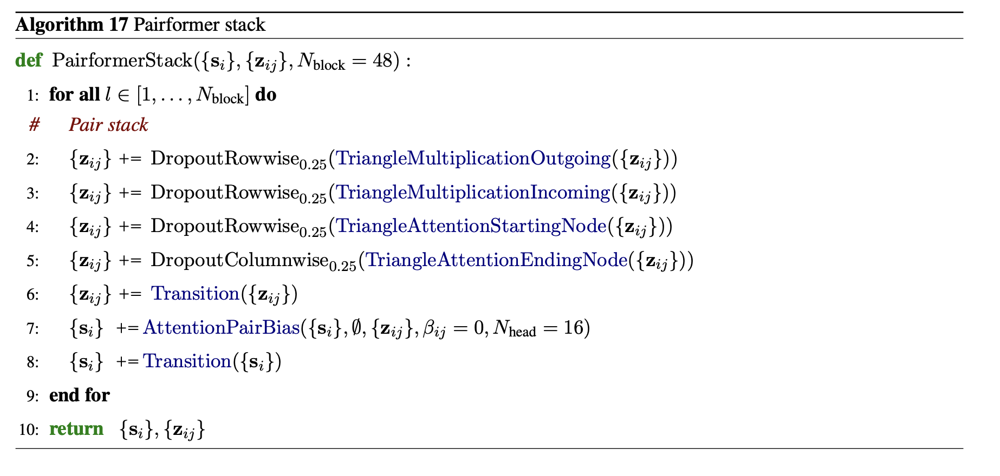
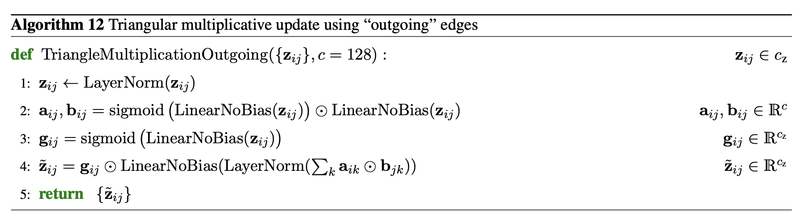
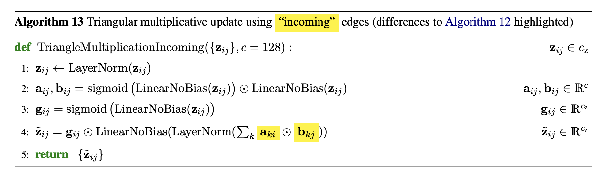

# `pairformer_stack.py` — PairformerStack

[← back to architecture overview](../README.md)

Implements the AF3 Pairformer: triangle-multiplicative and triangle-attention
updates to a pair embedding `z`, optionally jointly refining a single
embedding `s`. Used by [`TemplateEmbedder`](template_embedder.md) (on `z`
alone) as the internal refinement stack for template features.



## `TriangleMultiplicationOutgoing`



Algorithm 17, step 2. For each pair `(i, j)`:

```
m_ij = gate(z_ij) · proj_out(norm(Σ_k a_ik ⊙ b_kj))
```

where `a` and `b` are sigmoid-gated projections of the layer-normalised pair
embedding. The contraction `Σ_k a_ik ⊙ b_kj` sums over the shared index `k`
with `i` and `k` adjacent on `a` and `k` and `j` adjacent on `b` — the
"outgoing" edge direction.

## `TriangleMultiplicationIncoming`



Algorithm 17, step 3. Same gated-projection structure as the outgoing
variant, but with the contraction transposed: `m_ij = gate(z_ij) ·
proj_out(norm(Σ_k a_ki ⊙ b_jk))` — the "incoming" edge direction.

## `PairformerBlock`

One full AF3 Pairformer update, applied in sequence:

1. Outgoing triangle multiplication (rowwise dropout, p=0.25)
2. Incoming triangle multiplication (rowwise dropout)
3. Triangle attention, starting node — rowwise dropout
   ([pair_update.md](pair_update.md#triangleattentionstartingnodewithbias--step-3))
4. Triangle attention, ending node — columnwise dropout
   ([pair_update.md](pair_update.md#triangleattentionendingnodewithbias--step-4))
5. `Transition` FFN on `z` ([pair_update.md](pair_update.md#transition--step-5))
6. If a single embedding `s` is supplied: `AttentionPairBias(s, z)` followed
   by a `Transition` FFN on `s`
   ([node_update.md](node_update.md#attentionpairbias))

`c_pair` must be divisible by `n_heads`, or `InvalidPairHeadDimensionError`
is raised ([errors.md](errors.md)).

## `PairformerStack`

Chains `n_blocks` `PairformerBlock` instances, each individually
checkpointed via `torch.utils.checkpoint`. Overloaded to return just `z` when
called with `s=None`, or `(s, z)` when a single embedding is supplied —
matching AF3's Pairformer, which can operate on `z` alone or jointly on `z`
and `s`.
