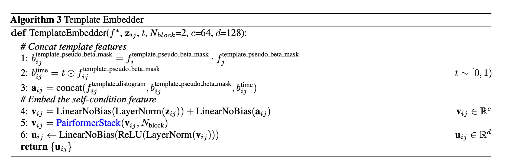

# `template_embedder.py` — TemplateEmbedder

[← back to architecture overview](../README.md)

`TemplateEmbedder` implements Algorithm 3 of the Pallatom architecture (a
distinct "Algorithm 3" from `RelativePositionEncoding`'s AF3 Algorithm 3 —
see [main_trunk.md](main_trunk.md#relativepositionencoding)). It folds a
distogram-based template representation, together with a time-conditioning
signal and the current trunk pair embedding, into a fixed-size pair output
used to augment `z_ij` in `MainTrunk.embed_inputs` (step 6).

## Steps

1. **`b_mask`** — outer product of the pseudo-beta validity mask
   `f_pseudo_beta_mask` with itself, giving a per-pair validity flag.
2. **`b_time`** — the time-conditioning signal `t` gated by `b_mask`.
3. **`a_ij`** — concatenation of `f_distogram`, `b_mask`, and `b_time` along
   the feature axis.
4. **`v_ij`** — `LinearNoBias(LayerNorm(z_ij)) + LinearNoBias(a_ij)`: the
   trunk pair embedding and the template features are projected into a shared
   internal dimension `c` and summed.
5. **`v_ij = PairformerStack(v_ij)`** — refined through `n_blocks` Pairformer
   blocks operating on `z` alone (`s=None`); see
   [pairformer_stack.md](pairformer_stack.md).
6. **`u_ij`** — `LinearNoBias(ReLU(LayerNorm(v_ij)))` projects to the output
   dimension `d`.

With multiple templates, step 6's `u_ij` would be averaged across templates
after the layer norm, then passed through one more
`LinearNoBias(ReLU(·))` — Pallatom currently uses a single template per
structure, so this averaging step is a no-op and is not implemented.
