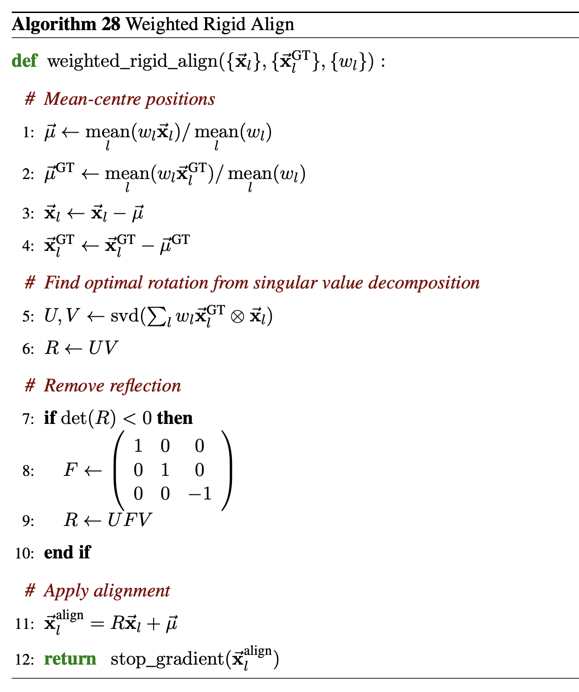
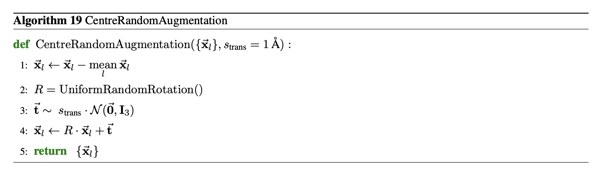

# `alignment.py` — rigid structure alignment via the Kabsch algorithm

[← back to helpers overview](README.md)

Pure PyTorch, batched, optionally-masked rigid alignment between two sets of
3D coordinates (Kabsch, 1976), plus RMSD helpers and the two rigid-motion
utilities used throughout training and sampling: `masked_com` and
`centre_random_augment`.

## `kabsch_rotation`

Computes the optimal rotation matrix `R` (proper rotation, `det(R) = +1`)
that minimises `||W^(1/2) (P @ R.T - Q)||_F` between an already-centred
mobile structure `P` and reference structure `Q`, via SVD of the
cross-covariance matrix `H = Pᵀ W Q`. Optional per-residue `weights` let
callers down-weight or mask out missing/flexible residues from the rotation
estimate. Reflection is corrected by flipping the sign of the column
corresponding to the smallest singular value whenever `det(V @ Uᵀ) < 0`, so
the returned matrix is always a proper rotation and never a mirror
reflection.

This is Pallatom/AF3's `WeightedRigidAlign` (embedded above): centre both
point sets, solve for the optimal rotation via SVD, and apply it — the same
three-step structure `kabsch_align` (below) implements end-to-end.

## `kabsch_align`

Full rigid-alignment pipeline built on `kabsch_rotation`:

1. Compute (weighted) centroids of `mobile` and `target`.
2. Centre both structures.
3. Compute the optimal rotation `R` via `kabsch_rotation`.
4. Apply: `aligned = (mobile - c_mobile) @ Rᵀ + c_target`.

`return_transform=True` additionally returns `(R, t_mobile, t_target)` so the
same rigid transform can later be re-applied to other coordinate sets (e.g.
side-chain atoms not included in the alignment) via `apply_transform`. This
is the alignment used by `atom_loss` in
[`architecture/docs/losses.md`](../architecture/docs/losses.md) — the ground
truth is rigidly aligned onto the (fixed) denoised prediction before the MSE
is computed — and by `take_step`'s RMSD monitoring metric in
[`train/README.md`](../train/README.md).

## `rmsd` / `kabsch_rmsd`

`rmsd` computes root-mean-square deviation between two **already-aligned**
coordinate sets, with optional per-residue `weights` and/or a boolean
`mask` (applied on top of weights). `kabsch_rmsd` composes `kabsch_align`
and `rmsd`: align `mobile` onto `target`, then report the RMSD — the
standard structure-comparison metric reported in Ångströms.

## `apply_transform`

Applies a previously-computed rigid transform `(R, t_from, t_to)` — as
returned by `kabsch_align(..., return_transform=True)` — to a *different* set
of coordinates than the one the transform was fit on: `coords_aligned =
(coords - t_from) @ Rᵀ + t_to`.

## `masked_com`

Per-batch centre of mass, optionally restricted to valid (unpadded) atoms via
a boolean mask so zero-padded atom slots don't bias the centroid toward the
origin. Used everywhere a structure needs to be re-centred without
contaminating the mean with padding: `MainTrunk`'s decoder loop, the EDM
sampler's initial noise draw and per-step noise injection (see
[`sample/README.md`](../sample/README.md)), and `centre_random_augment`
below.

## `centre_random_augment`

Implements `CentreRandomAugmentation` from AF3 Algorithm 19:

1. Subtract the (masked) per-batch centroid via `masked_com`.
2. Apply one independent Haar-uniform `SO(3)` rotation per batch element,
   sampled via QR decomposition of a Gaussian matrix (Mezzadri, 2007):
   column `j` of `Q` is rescaled by `sign(R_jj)` to fix the canonical QR
   sign ambiguity, and the last column is negated whenever `det(Q) = -1` so
   the sampled rotation is always restricted to `SO(3)` (proper rotations
   only, never a reflection).
3. Add independent Gaussian translation noise `t ~ s_trans · N(0, I₃)` per
   batch element.

Used both as **training-time augmentation** (`featurize_single_item` in
[`data.md`](data.md) applies it once per protein before noising, so the
model never sees a canonical global frame) and as **per-step test-time
augmentation** inside the EDM sampling loop (see
[`sample/README.md`](../sample/README.md#3-the-reverse-diffusion-loop)),
where it is re-applied at every denoising step.
