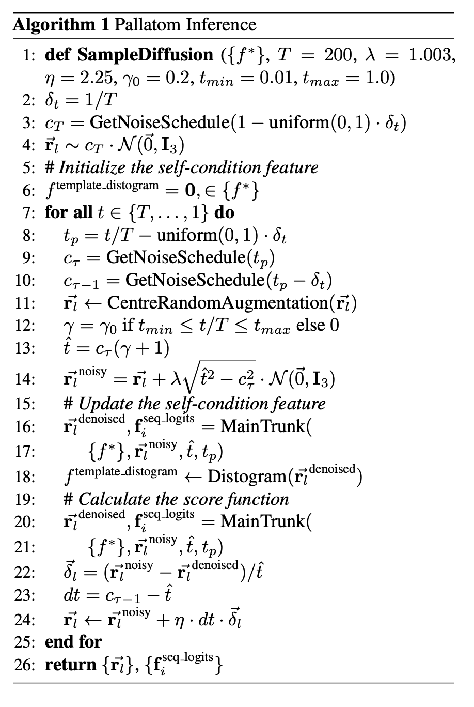

# pallatom/sample

EDM (Karras et al. 2022) sampling of protein structures and sequences from a
trained `MainTrunk` denoising model. Implements the Pallatom inference
procedure below, running the reverse diffusion trajectory from pure noise
down to a denoised all-atom structure and its decoded amino-acid sequence.



## Contents

| File | Purpose |
|------|---------|
| `sampling.py` | `EDMSampler` (the Heun/Euler ODE sampler implementing the algorithm above), context-building helpers (`AllAtomContext`, `TemplateContext`, `build_sampling_context`), and the `main` CLI entry point. |
| `sample_config.py` | Frozen Pydantic models (`SampleConfig`, `SamplerParams`, `GenerationParams`, `SampleCheckpointParams`, `SampleOutputParams`) describing a sampling run. |

## How it works

1. `build_sampling_context` constructs a static `FeaturizedBatch` — reference
   atom positions, element one-hots, residue indices, and (optionally) a
   template distogram from a PDB file — tiled to the requested batch size.
2. `EDMSampler.sample` runs the reverse diffusion loop:
   - Draws initial noisy coordinates at `c_T` and iterates the noise schedule
     down to `c_0`.
   - At each step, applies `centre_random_augment`, optional stochastic churn
     (`S_churn`, `S_tmin`, `S_tmax`), and a self-conditioning pass through
     `MainTrunk` to refresh the template distogram before the score-estimating
     denoise call.
   - Takes a scaled Euler step (`eta_step_scale`) toward the next noise level.
   - After the final step, decodes the amino-acid sequence from the sequence
     logits via low-temperature softmax.
3. `main` loads a checkpoint, runs `EDMSampler.sample`, converts the sampled
   atom5 coordinates to atom37, and writes the resulting structures as a JSON
   list of PDB strings.

## Usage

```bash
python -m sample.sampling --config path/to/sample_config.json --log_file path/to/log.jsonl
```

The config JSON is validated against `SampleConfig`
(`sample_config.py`), which nests:

- `model`, `distogram_res`, `distogram_atom`, `noise` — architecture and
  noise-schedule parameters shared with training (`train.train_config`).
- `sampler` — `SamplerParams` (`rho`, `S_churn`, `S_tmin`, `S_tmax`,
  `S_noise`, `ddim_steps`, `eta_step_scale`, `seq_temperature`).
- `generation` — `GenerationParams` (`n_res`, `n_samples`).
- `checkpoint` — path to the `.pt` checkpoint to load.
- `output` — path to write the JSON list of sampled PDB strings.
