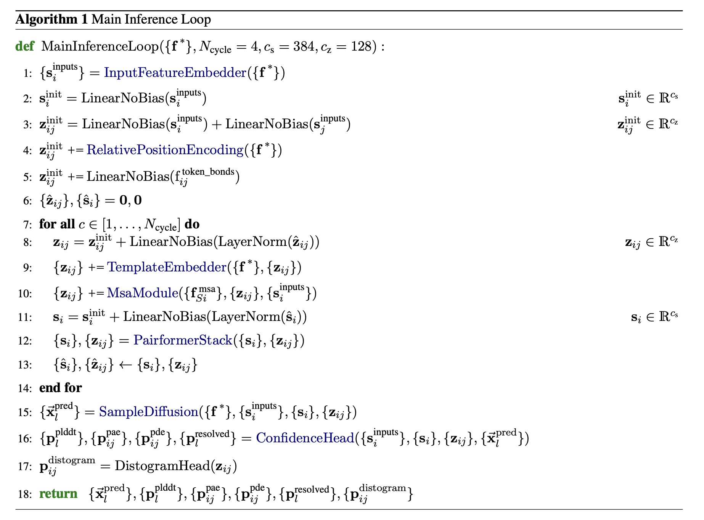

# pallatom/sample

EDM (Karras et al. 2022) sampling of protein structures and sequences from a
trained `MainTrunk` denoising model. Implements the Pallatom inference
procedure below (`EDMSampler.sample`, docstring: "Pallatom sampler, Algorithm
1"), running the reverse diffusion trajectory from pure noise down to a
denoised all-atom structure and its decoded amino-acid sequence.


## Contents

| File | Purpose |
|------|---------|
| `sampling.py` | `EDMSampler` (the Euler ODE sampler implementing the algorithm above), context-building helpers (`AllAtomContext`, `TemplateContext`, `build_sampling_context`), and the `main` CLI entry point. |
| `sample_config.py` | Frozen Pydantic models (`SampleConfig`, `SamplerParams`, `GenerationParams`, `SampleCheckpointParams`, `SampleOutputParams`) describing a sampling run. |

## Background: EDM sampling

Karras et al. 2022 ("Elucidating the Design Space of Diffusion-Based
Generative Models") frame diffusion sampling as solving a **probability flow
ODE** backwards from pure noise to data:

```
dr/dsigma = (r - D_θ(r, sigma)) / sigma
```

where `sigma` is the current noise level and `D_θ` is the denoiser — here,
`MainTrunk` — trained to map a noisy structure `r` at noise level `sigma`
back to an estimate of the clean structure. Sampling walks `sigma` down a
fixed schedule from `sigma_max` to `sigma_min`, evaluating `D_θ` once (or
more, with a higher-order corrector) per step and taking an Euler (or
Euler-Heun) step along the ODE.

This is a direct generalisation of DDIM/score-based sampling: `(r -
D_θ(r,sigma)) / sigma` is exactly the score-based drift term, and `D_θ`
itself is preconditioned inside `MainTrunk.embed_inputs`
(`architecture/main_trunk.py`, step 1: `r_scaled = r_input / sqrt(sigma_data²
+ t̂²)`, the EDM `c_in` factor; see
[`architecture/docs/main_trunk.md`](../architecture/docs/main_trunk.md)) and
un-preconditioned again in the decoder loop (step 14: `c_skip`/`c_out`
weighting) so `D_θ` always operates on unit-variance inputs regardless of
`sigma`.

`EDMSampler` also supports the **stochastic** (SDE) variant of EDM sampling:
optionally injecting a small amount of extra noise before each denoising
call (`S_churn > 0`), analogous to DDIM `η > 0`. This trades a small amount
of extra score-function evaluations for improved sample diversity/quality by
letting the trajectory "wander" off the deterministic ODE path and get
corrected back onto it by the next denoising step.

The AlphaFold 3 sampler this design descends from is `SampleDiffusion`
(Algorithm 18 in the AF3 paper):



Pallatom's Algorithm 1 (embedded above) follows the same overall shape —
noise schedule, per-step centering/augmentation, churn, denoise, Euler
step — with two Pallatom-specific additions: **self-conditioning** on a
same-step template distogram (see step 4 below) and a single scaled Euler
update in place of AF3's Heun predictor-corrector (see
[Why no Heun corrector?](#why-no-heun-corrector) below).

## The sampling algorithm, step by step

`EDMSampler.sample` (`sampling.py`) is the entry point; everything below
walks through its body in order.

### 1. Build the static context

Before any denoising happens, `build_sampling_context` assembles a
`FeaturizedBatch` that stays fixed for the whole trajectory (only the noisy
coordinates, the current noise level, and — via self-conditioning — the
template distogram change step to step):

- **`build_aa_context`** converts a `Protein` (either a real structure loaded
  from a PDB template, or an all-zero placeholder with the requested residue
  count when no template is given) from the atom37 representation to the
  compact atom5 representation (`N`, `CA`, `C`, `O`, `CB`), derives per-atom
  and per-residue validity masks, and precomputes a **sparse** ground-truth
  atom-pair distogram over each atom's local `K`-neighbour window (see
  `build_sparse_pairs` in
  [`architecture/docs/atom_transformers.md`](../architecture/docs/atom_transformers.md)).
  All tensors are tiled to `batch_size` so every sample in the batch starts
  from the same protein skeleton and residue count.
- **`build_template_context`** extracts pseudo-β (Cβ) carbon positions from
  the template structure via `atom37_to_cb` and runs them through a
  `Distogram` module to get the initial `f_template_distogram` — the
  structural conditioning signal `TemplateEmbedder` consumes (see
  [`architecture/docs/template_embedder.md`](../architecture/docs/template_embedder.md)).
- The reference atom conformer (`ref_pos`, `ref_element`) is tiled from a
  single alanine residue across every position — sampling always starts from
  a sequence-agnostic geometry and lets the model predict both structure and
  sequence — and `r_gt_noised` is seeded with `r_gt + t̂ · noise` as a
  placeholder that every sampling step immediately overwrites.

### 2. Initialise the trajectory at `sigma_max`

```python
c_T = noise_schedule(1 - uniform(0, 1) * delta_t)
r_l = c_T * N(0, I)         # per-atom Gaussian noise
r_l = r_l - masked_com(r_l) # zero-centred, matching training data convention
```

`delta_t = 1 / total_timesteps` is the fixed step size in *normalized* time
`t ∈ [0, 1)`; a small random jitter (`uniform(0, 1) * delta_t`) is
subtracted before the first noise level is computed so the very first sample
isn't always drawn at exactly `sigma_max`. `noise_schedule` (below) then
converts this normalized time into an actual noise level `sigma`. The
initial coordinates are pure Gaussian noise, scaled to `sigma_max` and
re-centred to zero centre-of-mass via `masked_com` — the same convention
`MainTrunk` was trained under, restricted to valid (unpadded) atoms.

### 3. The reverse-diffusion loop

For `timestep` in `1 .. total_timesteps - 2`:

1. **Time step + dequantization jitter**:
   `t_p = timestep / total_timesteps - uniform(0, 1) * delta_t`, then
   `c_T = noise_schedule(t_p)` and `c_T_minus_one = noise_schedule(t_p -
   delta_t)` — the noise levels at the current and next step.
2. **`centre_random_augment`** (AF3 Algorithm 19) is applied to `r_l` at the
   start of every step: subtract the (masked) centroid, apply one
   Haar-uniform random `SO(3)` rotation and one Gaussian random translation
   per batch element. This is a form of test-time augmentation — it prevents
   the model from ever seeing (or relying on) a canonical global frame, so
   the same structure sampled twice doesn't collapse to the same orientation
   and the model can't shortcut on absolute position/orientation cues.
3. **Stochastic noise injection (churn)**: `gamma = S_churn` if `timestep /
   total_timesteps` falls inside `[S_tmin, S_tmax]`, else `0`. The
   temporarily-increased noise level is `t_hat = c_T * (gamma + 1)`, and
   fresh (centre-of-mass-zeroed) Gaussian noise scaled by `S_noise *
   sqrt(t_hat² - c_T²)` is added to `r_l` to actually reach that higher
   noise level — this is what makes the sampler stochastic (SDE) rather than
   purely deterministic (ODE) when `S_churn > 0`.
4. **Self-conditioning, then denoise** — two calls to `EDMSampler.denoise`
   (which just injects the current noisy coordinates/noise level into the
   static context and runs `MainTrunk`):
   - The **first** call denoises `noisy_r_l` using whatever template
     distogram is already in the context (the one built once in step 1, from
     the actual template — or lack thereof). Its `r_denoised` output is
     converted back to atom37 (`atom5_to_atom37`) and reduced to Cβ
     positions (`atom37_to_cb`), which are fed through the distogram
     function to build a **same-step** self-conditioning template distogram.
   - The **second** call re-denoises the same `noisy_r_l`, this time with
     that freshly-computed self-conditioning distogram substituted in. Its
     `r_denoised`/`seq_logits` are the ones actually used for the ODE step.
   This lets the model condition its structural denoising on its own
   preliminary structural guess for the same step — a form of iterative
   refinement within a single diffusion step, at the cost of two forward
   passes instead of one.
5. **Euler step**: the score-based drift is estimated as `delta_l = (noisy_r_l
   - r_denoised) / t_hat` (exactly `dr/dsigma` from the probability flow ODE
   above, evaluated at `sigma = t_hat`), and the step is taken as
   ```
   dt  = c_T_minus_one - t_hat        # negative: moving to lower noise
   r_l = noisy_r_l + eta_step_scale * dt * delta_l
   ```
   `eta_step_scale` (default `2.25`, must be `> 1`) scales the nominal Euler
   step — see [Why no Heun corrector?](#why-no-heun-corrector).

#### Why no Heun corrector?

The original Karras et al. sampler (and AF3's `SampleDiffusion`) optionally
applies a second-order Heun correction after the Euler predictor step, at
the cost of a second denoiser evaluation per step. Pallatom's sampler
already pays for two forward passes per step for self-conditioning (point 4
above); the source code comment explains the tradeoff directly: *"if using
churn, why not apply a second order correction? speed. 2x the number of NFE
[network function evaluations]."* Instead, `eta_step_scale` gives a single
tunable knob to compensate for first-order Euler's systematic
under-/over-shoot without doubling the per-step cost again.

### 4. Decode the final structure and sequence

After the loop, the amino-acid sequence is decoded once from the final
`seq_logits` via a low-temperature softmax argmax:

```python
decode_seqs = argmax(softmax(seq_logits / seq_temperature), dim=-1)
```

lower `seq_temperature` sharpens the distribution towards the model's most
confident residue identity at each position. The final coordinates are
re-centred to zero centre-of-mass (`masked_com`) one last time before being
returned.

### 5. `main` — end-to-end CLI entry point

Loads a checkpoint into `MainTrunk`, builds the atom/template `Distogram`
modules and the static sampling context (`build_sampling_context`), runs
`EDMSampler.sample`, converts the resulting atom5 coordinates back to atom37
(`atom5_to_atom37`), and writes every sampled structure as a PDB string into
a single JSON list at `scfg.output.output_path`.

## Parameters (`sample_config.py`)

`SampleConfig` is the top-level, frozen Pydantic model validated from the
JSON file passed via `--config`. It aggregates the model architecture
parameters shared with training (`model`, `distogram_res`, `distogram_atom`
— see `train/train_config.py`) plus four sampling-specific groups:

### `noise` — `NoiseScheduleParams` (imported from `train.train_config`)

Although this model is defined in `train_config.py` (it's shared with
training), every one of its fields directly parameterises the EDM sampler's
noise schedule (`EDMSampler.noise_schedule`, step 3.1 above):

| Field | Default | Role in sampling |
|---|---|---|
| `sigma_data` | `16.0` | Scales the whole noise schedule (`t_hat = sigma_data * (...) ** rho`) and is the EDM preconditioning constant used inside `MainTrunk` to normalise `D_θ`'s input/output regardless of noise level. |
| `sigma_max` | `160` | The noise level the trajectory starts at (`c_T` at `timestep=0`); must be large enough that `sigma_max`-noised data is indistinguishable from pure Gaussian noise. |
| `sigma_min` | `4e-4` | The noise level the trajectory ends at; sampling stops just above pure clean data rather than at exactly `sigma=0`, matching EDM's schedule (which is only defined for `sigma > 0`). |
| `P_mean`, `P_std` | `-1.2`, `1.5` | Parameters of the log-normal distribution used to sample *training* noise levels — not used during sampling itself, but part of the same config group since the model and its noise schedule must be trained and sampled with consistent `sigma_data`/`sigma_min`/`sigma_max`. |

### `sampler` — `SamplerParams`

The core EDM/DDIM sampler hyperparameters, consumed directly by
`EDMSampler.__init__`:

| Field | Default | Role in sampling |
|---|---|---|
| `rho` | `7.0` | Exponent in the noise schedule `t_hat = sigma_data * (sigma_max^(1/rho) + t·(sigma_min^(1/rho) - sigma_max^(1/rho)))^rho`. Higher `rho` concentrates more of the `total_timesteps` steps near the *low*-noise end of the schedule, since the schedule is non-linear in `t` — most of diffusion sampling's useful structural refinement happens at low noise, so this spends the step budget where it matters most. |
| `S_churn` | `0.2` | The stochastic noise-injection strength `gamma` used inside the `[S_tmin, S_tmax]` window (step 3.3 above). `0` recovers the fully deterministic ODE sampler; the default `0.2` makes the sampler mildly stochastic (SDE-like), generally improving sample diversity at a small quality cost. |
| `S_tmin` | `0.01` | Lower bound (in normalized time, `timestep / total_timesteps`) of the window in which churn is applied. |
| `S_tmax` | `1.0` | Upper bound of the churn window. Together `[S_tmin, S_tmax]` restricts stochastic noise injection to a sub-range of the trajectory — injecting extra noise very close to `sigma_min` tends to hurt rather than help, hence excluding the tail below `S_tmin`. |
| `S_noise` | `1.003` | Multiplicative scale on the extra Gaussian noise injected during churn (`eps`); slightly `> 1` to counteract a known slight variance-loss bias in the discretised SDE, per the original EDM paper's recommendation. |
| `ddim_steps` | `200` | `total_timesteps` — the total number of denoising iterations in the trajectory (must be `> 1`). More steps means finer-grained ODE integration (lower discretisation error) at the cost of proportionally more `MainTrunk` forward passes (×2 per step for self-conditioning). |
| `eta_step_scale` | `2.25` | Multiplicative scale on the Euler step `dt * delta_l` (step 3.5 above); must be `> 1`. Compensates for the lack of a Heun corrector — see [Why no Heun corrector?](#why-no-heun-corrector) — by deliberately over-shooting the naive first-order step. |
| `seq_temperature` | `0.1` | Softmax temperature used only at the very end of sampling (step 4 above) to decode the discrete amino-acid sequence from the final `seq_logits`. Low temperature (`0.1`) makes decoding close to a hard argmax; higher values would sample more diverse sequences at the cost of confidence. |

### `generation` — `GenerationParams`

| Field | Default | Role in sampling |
|---|---|---|
| `n_res` | `100` | Number of residues in each generated structure; determines `N_atom = n_res * 5` (atom5 representation) and the size of every tensor in the static sampling context. |
| `n_samples` | `1` | Batch size `B` — number of independent structures sampled in parallel per run, all sharing the same `n_res` and (if given) the same template. |

### `checkpoint` — `SampleCheckpointParams`

| Field | Default | Role in sampling |
|---|---|---|
| `checkpoint_path` | `"pallatom_best.pt"` | Filesystem path to the trained `MainTrunk` weights (`state_dict` under key `"model"`) loaded before sampling begins. |

### `output` — `SampleOutputParams`

| Field | Default | Role in sampling |
|---|---|---|
| `output_path` | `"samples.json"` | Filesystem path where the JSON list of sampled PDB strings is written at the end of `main`. |

## Usage

```bash
python -m sample.sampling --config path/to/sample_config.json --log_file path/to/log.jsonl
```

The config JSON is validated against `SampleConfig` (`sample_config.py`),
nesting `model`/`distogram_res`/`distogram_atom` (shared architecture
parameters), `noise` (`NoiseScheduleParams`), `sampler` (`SamplerParams`),
`generation` (`GenerationParams`), `checkpoint`
(`SampleCheckpointParams`), and `output` (`SampleOutputParams`) as
documented above.
